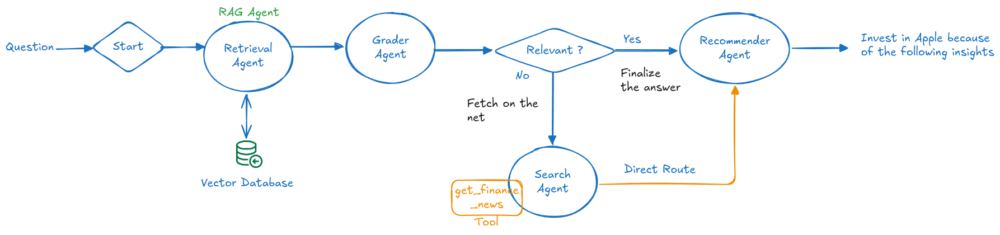
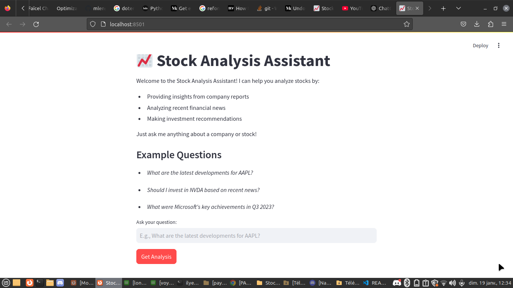

# Stock Analysis Assistant - Agentic RAG



## Overview

The Stock Analysis Assistant is a sophisticated AI-powered application designed for stock analysis and investment recommendations. Leveraging advanced Agentic Retrieval-Augmented Generation (RAG) architecture, the system extracts insights from financial news and provides actionable recommendations tailored to user queries.

The project is implemented using the following:
- **LangChain** for building agents and handling LLM interactions.
- **Chroma** for document retrieval and semantic search.
- **Streamlit** for an interactive user interface.
- **Finnhub API** for fetching real-time financial news and data.

---

## Project Structure

### Folder Layout

- **app/**
  - `main.py`: Entry point for the Streamlit-based application.
  - `data/`: Stores input data and vectorized documents.

- **notebooks/**
  - `agentic_rag.ipynb`: Jupyter notebook for experiments and testing the architecture.

- **src/**
  - `backend.py`: Implements the RAG-based architecture and the agent functionalities.
  - `__init__.py`: Initialization file for the `src` package.

- **utils/**
  - Contains helper scripts for configuration and shared utilities.
  
- **tests/**: Folder for unit tests to ensure code reliability.

---

## Architecture Details

The application employs an **Agentic RAG** workflow for stock analysis, as outlined in the diagram above:

### 1. **Retrieval Agent**
- Connects to the **Vector Database** (Chroma) to retrieve relevant documents based on the user's query.
- Embedding model: `granite-embedding`.

### 2. **Grader Agent**
- Evaluates the relevance of retrieved documents to the query using an LLM.
- Generates binary relevance scores ("yes" or "no") based on the semantic overlap with the query.

### 3. **Search Agent**
- When retrieved documents are not relevant, the agent fetches the latest financial news using the **Finnhub API**.
- Extracts company ticker symbols and retrieves recent news articles.

### 4. **Recommender Agent**
- Processes relevant documents or news articles to generate investment recommendations.
- Utilizes prompt-based LLMs for actionable insights.

---

## Core Functionalities

### Retrieval
- Embeds data into a vectorized format using **Ollama Embeddings**.
- Efficient search of documents relevant to stock-related questions.

### Relevance Grading
- Grades the retrieved documents using a custom **ChatPromptTemplate**.
- Filters irrelevant data before passing information downstream.

### Financial News Search
- Leverages **Finnhub API** to fetch real-time financial news based on the query.
- Ensures the recommendations are grounded in the latest market trends.

### Recommendation Generation
- Uses the **Recommender Agent** to suggest actionable investment strategies.
- Examples: Buy/Sell/Hold decisions based on recent news insights.

---

## Installation

### Prerequisites
1. Python 3.9+
2. Finnhub API Key (Add it to a `.env` file)

### Steps
1. Clone the repository:
   ```bash
   git clone https://github.com/your-repo/stock-analysis-assistant.git
   cd stock-analysis-assistant
   ```
2. Install dependencies:
   ```bash
   pip install -e .
   pip install -r requirements.txt
   ```
3. Make sure you have llama3.2:latest:
   ```bash
   ollama run llama3.2:latest
   ```
4. Run the Streamlit application:
   ```bash
   streamlit run app/main.py
   ```

---

## Usage

1. Launch the application using Streamlit.
2. Enter a query such as:
   - "What are the latest updates on Apple?"
   - "Should I invest in Tesla?"
3. The system processes the query through the Agentic RAG architecture and provides:
   - Relevant financial insights.
   - Actionable investment recommendations.

---

## Key Files

- **`src/backend.py`**
  - Implements the complete RAG pipeline including retrieval, grading, search, and recommendation nodes.
- **`.env`**
  - Stores sensitive API keys for external services like Finnhub.

---

## Technologies Used

- **LangChain**: RAG pipelines and agent orchestration.
- **Chroma**: Vector database for document retrieval.
- **Ollama Embeddings**: High-quality embeddings for semantic search.
- **Finnhub API**: Financial news and market data.
- **Streamlit**: Interactive front-end for user queries and recommendations.

---

## Contributors

- **AIT SAID Azzedine**
- **DJERFAF Ilyes**
- **KESKES Nazim**

---

## License

This project is licensed under the MIT License. See the [LICENSE](./LICENSE) file for details.

---

## Screenshots

1. Architecture Diagram
   
2. Streamlit Application
   

---

## Future Improvements

- Integration of advanced sentiment analysis for financial news.
- Support for multiple financial APIs.
- Historical performance tracking of recommendations.

---

## Feedback

Feel free to open issues or contribute via pull requests. For inquiries, contact us :).
